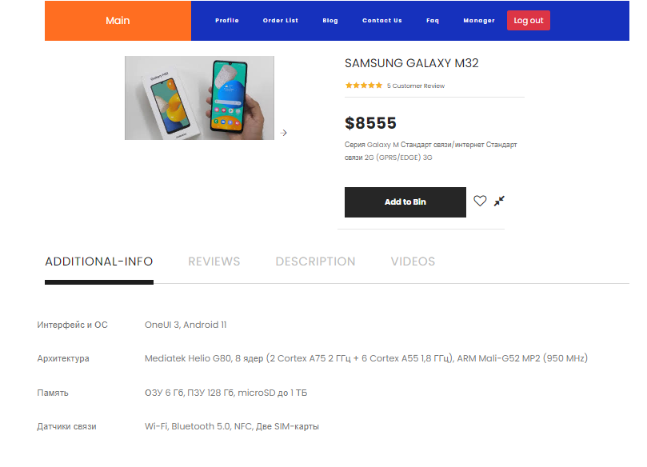
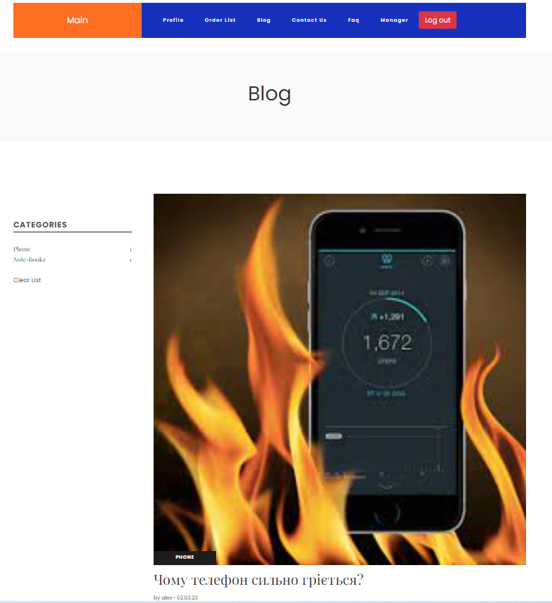
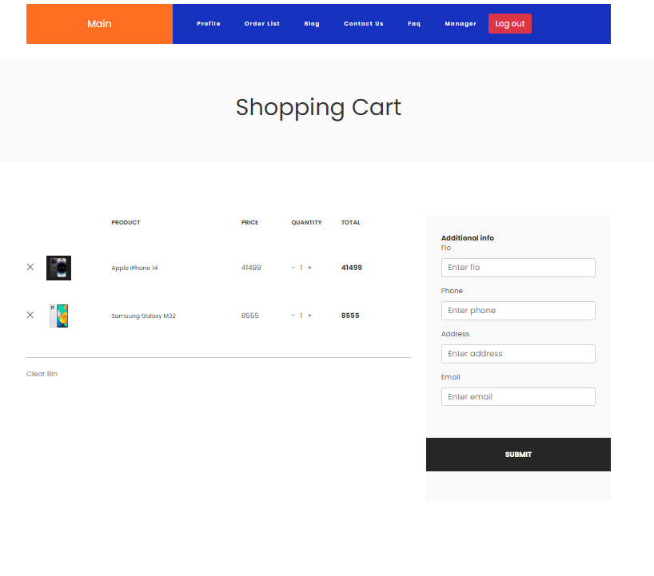
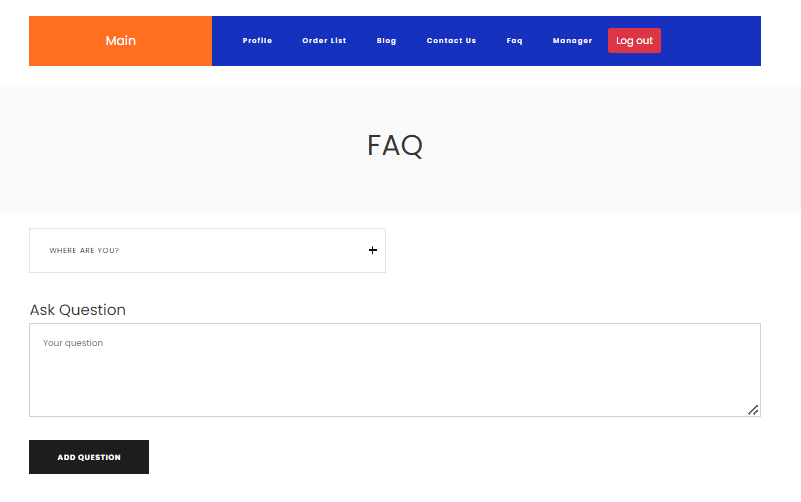
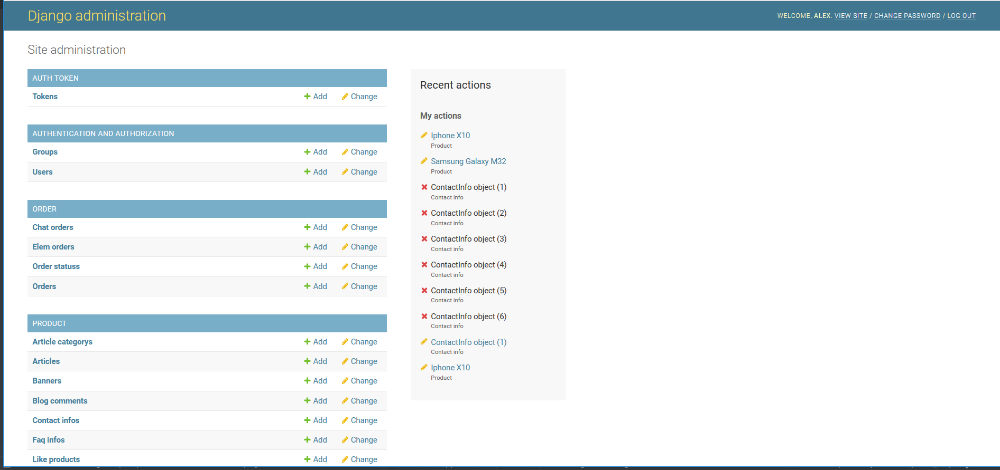

# Phone shop
On the site you can find different models of phones, its images and characteristics, you can also watch a video about the phone you like, leave a review and make a test order of the phone (order confirmation will be sent on your email)

___
# Technologies used in the project:
* Django
* Angular
* Html
* Python
___
# How to run
1. git clone [phone-shop](https://github.com/Alex-r6/Phone_shop.git)
2. docker-compose built
3. docker-compose up

___
# Functionality
* On the main page, you can view phone models, go to the detailed phone view page, and the search and filter functions by category are also implemented.

* On the detailed view page, you can view the characteristics of the phone, write a comment to the phone, watch a video about the phone, and also send the phone to the trash-bin.

* You can read news from the world of phones.

* On the cart page, you can place an order for goods. Empty the cart, change the quantity of goods.

* You can ask us your question.

* Також на проекті можна додавати змінювати товари  або робити інші маніпуцяції з даними за допомогою адмінки.Для цього на проекті реалізован Django Admin

