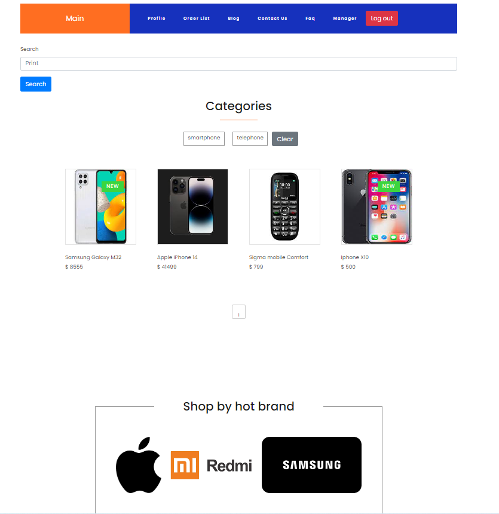

# Phone shop
On the site you can find different models of phones, their images and characteristics, you can also watch a video about the phone you like, leave a review and make a test order of the phone (order confirmation will be sent on your email)

___
# Technologies used in the project:
* Django
* Angular
* Html
* Python
___
# How to run
1. git clone [phone-shop](https://github.com/Alex-r6/Phone_shop.git)
2. docker-compose built
3. docker-compose up

___
# Functionality
* On the main page, you can view phone models, go to the detailed phone view page, and also perform search by categories.

* On the detailed view page, you can view the characteristics of the phone, write a comment, watch a video, and also send the phone to the cart.

* In blog you can read news from the world of phones.

* On the cart page, you can place an order for goods, change the quantity of goods, discard order.

* In FAQ section you can ask your questions.

* Project also allows to add/change goods, or perform other operations with data with the help of admin. For these purposes Django Admin is used.

